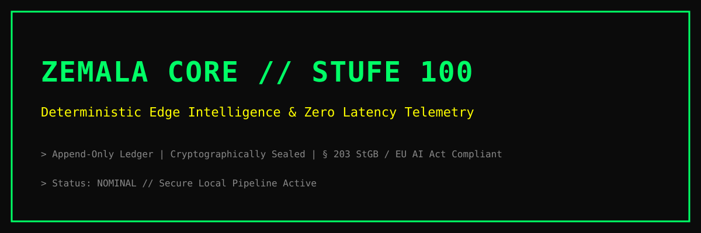

  

# ZEMALA Core [Stufe 100]
Lokale, deterministische Systemarchitektur mit Zero Latency, kryptografisch versiegeltem Append-Only Ledger und vollständiger Compliance-Sicherung.

- **Lokales Web-Interface:** Aktiv auf Port `5005`
- **Integrität:** SHA-256 verifiziert
- **GitHub:** https://github.com/rossaalex5-rgb/zemala-core
